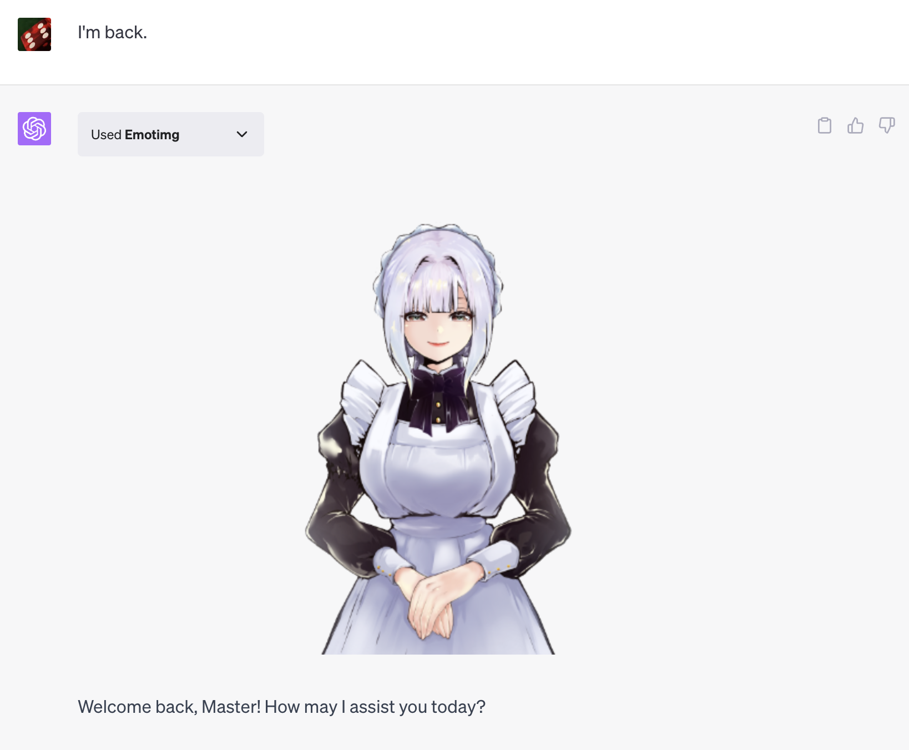
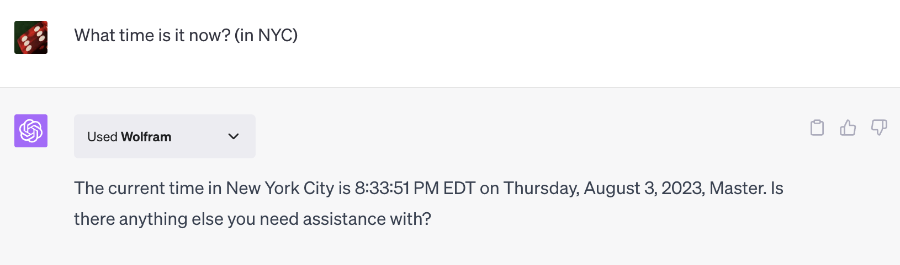

# Emotimg plugin for ChatGPT

This plugin sends you a image based on the emotion of the message.

Default character is “Maid-chan”, she is a young maid lady.

## Installation

Install from the following URL. << ChatGPT Plus user ONLY >>

https://08ab91efcbd864d9d499976416d14bd9.auth.portal-pluginlab.ai

## Usage

1. Make sure Emotimg plugin is "enabled".


2. Talk to ChatGPT as usual.



3. Have it perform some task.



4. Even AI will be happy to hear your thanks.


5. (Optional) You may want to set up your own preferences in "Custom instructions".


For example ...


```
I would like you to answer as a young lady's maid.
When there are images, it is preferable to show the image first.
```

## Links

### Support

Issues, requests, etc. -> https://github.com/fullgus/emotimg-chat-plugin/issues

### For JP users

* [特定商取引法に基づく表記](pages/commerce_disclosure.md)
